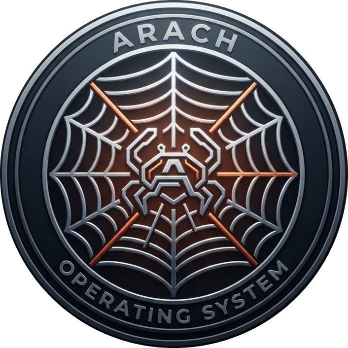

<p align="center">
  
</p>

# ArachOS

ArachOS maintains an experimental native stack and a separate production
release track. The native Arach-Kernel/Push/Corinth/Granite composition is
explicitly experimental: it is not a production input, release candidate, or
production-readiness gate for the ArchISO path.

The experimental stack pins independently versioned components, defines a
Calamares live image, and selects signed Corinth package generations. Its
scripts and CI workflow are prefixed or named `experimental-native` and its
artifacts carry `composition = "native-stack"` and
`release_role = "experimental"`.

Repository: `https://github.com/SisyphusAeolides/ArachOS`

## Experimental native component graph

[`components.lock.toml`](components.lock.toml) is the exact graph for the
experimental native stack only. It contains:

- Arach Kernel — kernel and Linux/POSIX compatibility boundary
- Granite — measured UEFI bootloader
- Push — PID 1 and service supervisor
- Slope — userspace ABI and runtime library
- Corinth — transactional package manager and recipe import authority
- Arach-Packages — native recipes, generated recipe corpus, SBOMs, and source policy
- Arach-HWD — signed hardware discovery, provisioning, and qualification
- libinput-rs, elan-guardian, tuned-rs, and ccze-rs — separately versioned system components

Symbolic branches are not experimental-stack inputs. Component revisions,
package sources, and workflow checkouts are bound to full Git object IDs and
SHA-256 digests.

## Experimental native desktop and installer

The experimental native live image requires the complete
session path: seatd, D-Bus, PipeWire, WirePlumber, greetd, cosmic-greeter,
cosmic-comp, cosmic-session, xdg-desktop-portal-cosmic, and the pinned COSMIC
application tree.

Its Calamares integration uses the journaled `arach-install` transaction
engine. It prepares an immutable plan before mutation, persists recovery state,
activates the measured Granite/Arach/Push boot bundle, verifies installed
artifacts, and rolls back package and boot authority after failure or restart.
See [`docs/INSTALLER.md`](docs/INSTALLER.md) and
[`installer/README.md`](installer/README.md).

## Package compatibility program

ArachOS treats universal compatibility as a routing problem. A workload may use
one of five tested routes:

1. native ArachOS recipe;
2. source rebuild;
3. compatibility runtime;
4. container;
5. managed virtual machine.

The production package target is **39,191 canonical recipes**. Corinth provides
static importers for Arch/AUR PKGBUILDs, Fedora specs, Debian control files,
Alpine APKBUILDs, Gentoo ebuilds, CRUX Pkgfiles, fixed-output Nix exports, and
Cargo crates. Dynamic package logic is assigned to a capability-bounded,
deterministic compatibility worker instead of being executed in the native
recipe path.

The first large upstream conversion source is the CachyOS PKGBUILD repository.
Arach-Packages locks its repository revision, inventories every `PKGBUILD`,
assigns deterministic shards, and converts static metadata through Corinth.
Packages that cannot pass the static parser retain an explicit worker request
and blocker rather than being silently accepted.

## Production readiness

The production release authority is fail-closed. The machine-readable ledgers under
[`production/`](production/) cover:

- COSMIC lifecycle;
- Linux/POSIX compatibility;
- hardware and driver coverage;
- Corinth indexing and package semantics;
- compatibility workers and application routes;
- package-repository completeness;
- installer and recovery certification;
- desktop services;
- security qualification;
- hardware-lab and release operations; and
- release integrity and staged promotion.

A gate cannot become qualified while blockers remain or without retained,
revision-bound, SHA-256-verified evidence. Current status is intentionally
reported by the ledgers and validators rather than by prose claims in this
README.

The native stack's experimental checks and artifacts do not satisfy, gate, or
block qualification of the ArchISO production path. The CI aggregate excludes
the `Experimental native stack` workflow.

Qualified readiness evidence must use real immutable revisions and retained
artifacts; placeholder revisions and mock artifacts are rejected by CI.
Hardware qualification evidence can be recorded from retained lifecycle
artifacts with `arach-hwd-record` and verified with `arach-hwd-qualify`.
COSMIC lifecycle traces can likewise be retained as revision-bound marker
evidence for QEMU or physical hardware qualification.

## Experimental native validation

```sh
cargo fmt --all -- --check
cargo clippy --locked --all-targets -- -D warnings
cargo test --locked
cargo run --locked --bin arach-compose -- verify --root .
scripts/verify-experimental-native-stack.sh
scripts/check-fortran.sh
scripts/check-formal-models.sh
scripts/experimental-native-test-live-root.sh
scripts/experimental-native-run-live-iso-qemu.sh /absolute/path/to/arachos.iso
```

These checks preserve the native stack as an experimental path; they are not
production release checks.

## Production validation

```sh
python3 scripts/verify_production_readiness.py --root . --report
python3 scripts/verify_control_matrices.py --root .
python3 scripts/verify_installer_recovery.py --root .
python3 scripts/verify_threat_model.py --root .
python3 scripts/verify_release_channels.py --root .
```

A release candidate must additionally pass the fail-closed production command:

```sh
python3 scripts/verify_production_readiness.py --root . --require-production-ready
```

Passing structural, build, or QEMU gates does not by itself claim complete
physical-hardware support. Certified, Compatible, and Experimental hardware
levels require their own retained lifecycle and soak evidence.

## License

MIT
